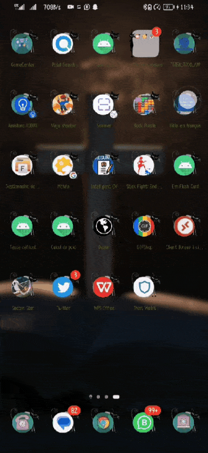

# Flash_card_E_B

# It is an application that asks a question and by clicking on the correct answer, it displays it in another page

# 
 
 

## Required
- [x] Create New Project in Xcode
- [x] Add a view for the front side of the flashcard to display the question
- [x] Add a view for the back side of the flashcard to display the answer
- [x] Build in logic to show the answer side when the card is tapped
- [x] Push code to GitHub
## Optional
- [x] Toggle the flashcard between the question side and the answer side
- [x] Style the question and answer side of the card to better distinguish between the two sides
- [x] Add selectable multiple choice answers beneath the card

Lab 2 : Flashcard App

 

Required
- [x] User can click on a ‘+’ button that takes the user to new ‘Add Card Screen’
- [x] The 'Add Card Screen' has a cancel button to take the user back to the main screen
- [x] User can enter and submit a Question and Answer through the 'Add Card Screen'
- [x] User will see the card they just created on the main screen when they press the 'Save Button'
- [x] Push your progress to GitHub!
Optional
- [] User can edit a card
- [] An error message is shown if the user doesn't enter both a Question and an Answer
- [] A notification is shown if the card was created successfully
- [] User can also enter multiple choice answers when creating a card
- [] App is further styled and customized!
